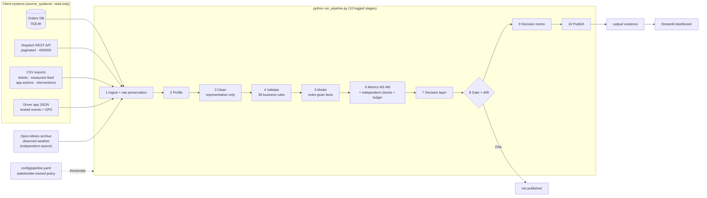

# FlashEats — from messy client systems to a decision ops can act on

**FDE Data Foundations Assignment (Classes 4–8) · Track A (FlashEats-style) · Bhuvanesh M S**

🎥 **Demo video:** _add the Loom link here after recording_ · script: [`docs/demo-script.md`](docs/demo-script.md)

> Client: *"Late deliveries are increasing and customers say our ETA is unreliable. Figure out what is happening before we invest in an AI delay-prediction system."* Leadership: *"Late Delivery Rate is 56 %."*

This repository builds a **dependable pipeline** from FlashEats' fragmented systems to a trustworthy KPI. The systems are a SQLite application database, a paginated Dispatch API, CSV exports and nested driver-app JSON, plus one independent public weather API. The pipeline then goes **one step past the classroom**: it turns the KPI into actions the client can take this week, each tested on data the rule never saw.

## 1 · Problem, stakeholders, KPI, decision

| | |
|---|---|
| **Problem** | More than half of deliveries miss the promised ETA. Nobody agrees on the number, and nobody knows *where* in the workflow the delay is created or what to do about it. |
| **Stakeholders** | VP Operations (proposed KPI owner) · Support Lead · Finance · Data Team · Dispatch · Fleet Ops · Restaurant Ops · Product / ETA service |
| **Project KPI** | **Reduce the late delivery rate**: the share of validated deliveries with `actual_delivery_at − promised_eta > 0 min` |
| **Decisions supported** | ① Which lifecycle stage to fix first. ② Which orders ops should intervene on, and when. ③ Whether the ETA or the operation is wrong. ④ Who, if anyone, to hold accountable. ⑤ Whether to fund the AI predictor now. |

## 2 · What this adds beyond the classroom

The four instructor notebooks are completed in [`Challenges/`](Challenges/). The class answers are the starting point; these additions open a different view ([full list and rationale](docs/beyond-the-classroom.md)):

| Addition | Result on the client data |
|---|---|
| **Early-warning trigger**: "not picked up *k* min after Dispatch's own estimate", chosen on 1–21 Aug and **proven on the held-out week** | **k = 10 min: 96 % precision, 72 % recall, ~45 min before the promise breaks.** 446 late orders it would catch got *no intervention* today. |
| **ETA calibration** | Dispatch's pickup estimate is short by a **median 8 min** (plans 18, reality 26). Padding every promise would need +12 min to reach 80 % on time, so fix the estimate instead. |
| **Independent source: observed weather** (Open-Meteo) checks the client's weather label | The label agrees with real rainfall at chance level (**kappa 0.01**), so "weather causes delays" cannot be defended with this field. |
| **GPS arrival feasibility test** | Pings converge on the restaurant in **0.8 %** of orders, so a geofence cannot replace the missing *arrived* event. |
| **Fair ranking** with Wilson intervals and a funnel plot | A naive top-10 would blame 10 restaurants; **only R024** is statistically worse than the fleet. |
| **Decision memo** generated every run: Situation → Complication → Resolution, with owners and measures | [`output/decision_memo.md`](output/decision_memo.md) |
| **Stakeholder-owned policy file**, **record ledger**, **run-over-run drift**, **interactive dashboard** with live simulators | [`config/pipeline.yaml`](config/pipeline.yaml) · `streamlit run app/dashboard.py` |

## 3 · Headline evidence (run `run_example`, gate **WARN → publish with caveats**)

| # | Metric | Value | Question answered |
|---|---|---|---|
| **M1** | Late delivery rate, validated population | **56.33 %** (837 / 1 486); 56.39 % on the dashboard definition, so leadership's 56 % holds for its definition | How large is the problem? |
| **M2** | Median lateness of late orders · P90 delay | **8.0 min** · 17.9 min | How late is late? |
| **M3** | Share of lateness accumulated **before pickup** | **98.9 %** | Where does the delay build up? |
| **M4** | Support contact rate on late orders | **30.7 %** vs 5.2 % on time | How do customers react? |
| **M5** | Intervention coverage · late rate with / without | **26.9 %** · 56.4 % / 56.3 % (association only; the log does not reconcile with Dispatch) | Does ops reach the right orders? |

Evidence table with numerators and Known / Unknown / Assumption / Limitation: [`output/evidence_table.md`](output/evidence_table.md) · gate: [`output/validation_gate.md`](output/validation_gate.md) · decision layer: [`output/insights/insights.md`](output/insights/insights.md)

**The FDE judgement call.** The natural next step after the class was "find more signals, build the predictor". The data says the delay is created before pickup, and a simple rule on Dispatch's *own* estimate already catches most late orders 45 minutes early. So the recommendation is: **ship the rule now, and make it the baseline any future model must beat.** A second call is on the 37 delivered orders with no delivery timestamp. They are neither back-filled nor dropped silently: they are reported as unknown, the KPI is bounded at 55.0–57.4 %, and the decision goes to Fleet Ops.

## 4 · Architecture



- **Source map:** business questions, the information they need, the source systems, their owners and grain, and the gaps. See [`docs/source-map.md`](docs/source-map.md).
- **Workflow and data model:** entities, events, states, interactions, interventions and outcomes, with ER and workflow diagrams. See [`docs/data-model.md`](docs/data-model.md).
- **Diagram sources:** the editable `.mmd` files are in [`docs/diagrams/`](docs/diagrams/).

## 5 · What the data-quality work found (nothing silently fixed)

| Finding | Action |
|---|---|
| 1 603 rows for 1 600 orders; the 3 duplicates disagree on `traffic_bucket` | keep the first row, quarantine the conflict |
| `Delivered`, `HIGH`, `READY / Ready / ready `, `Late Delivery` | representation normalised, every change logged |
| `handoff` vs `handed_off`, `ETA issue` vs `eta_changed` | **kept separate**, flagged for the owner |
| 37 delivered orders without a delivery time · 4 promises before creation (−10 min) · 5 deliveries before pickup (−5 min) | excluded from the validated population by rule id, listed by order |
| `orders.driver_id` = Dispatch's *original* driver for 1 597 orders | Dispatch is used as the final driver |
| `weather_bucket` vs observed rainfall: kappa 0.01 | rule WX-01 WARN; weather is not used to explain delays |
| Interventions log: 155 reassignments vs Dispatch 95, overlap 8 | intervention effectiveness declared not evaluable yet |
| Restaurant feed: 31 % coverage, minute precision, updates before the order exists | weekly analytics only |

- **Rules:** 38 business rules, each with a reason, an action and an owner. See [`docs/data-quality-rules.md`](docs/data-quality-rules.md).
- **Run results:** see [`output/data_quality_report.md`](output/data_quality_report.md).
- **Proof that nothing was lost:** [`output/reconciliation_ledger.csv`](output/reconciliation_ledger.csv) balances every dataset, raw = clean + duplicates + quarantined.

## 6 · Setup and run

```bash
cd assignment-2
python -m venv .venv && .venv\Scripts\activate          # Linux/macOS: source .venv/bin/activate
pip install -r requirements.txt

python run_pipeline.py --start-api                       # full run (~15 s) using config/pipeline.yaml
streamlit run app/dashboard.py                           # decision dashboard with live simulators
python -m pytest                                         # 111 tests: messy data, API and weather failures, decision layer, dashboard
python notebooks/build_notebooks.py                      # re-execute the 4 challenge notebooks + the walkthrough
```

**Try a policy change:** set `kpi.late_threshold_min: 10` in `config/pipeline.yaml` and rerun. Every metric, the gate and the memo follow, and `output/run_comparison.md` shows what moved.

**Useful flags:**
- `--api-url` points at an API that is already running.
- `--fallback-snapshot` reuses the last raw pages if the Dispatch API is down; the gate then shows WARN.
- `--no-weather` skips the external check.
- `--source-root <dir>` runs on another client pack.

**Exit codes:** `0` completed · `1` failed, such as a missing source or an unrecoverable API · `2` gate failed, outputs kept in `output/runs/<run_id>/` and not published.

## 7 · Repository map

| Path | Content |
|---|---|
| `Challenges/` | the **four instructor notebooks** (Class 5 Starter, Class 5 Student, Class 6 Student, Class 7 Challenge): original cells kept, answers inserted, executed |
| `notebooks/pipeline_walkthrough.ipynb` | the production pipeline run stage by stage, with each decision's evidence inline |
| `source_systems/` | the client systems as received (read-only) |
| `config/pipeline.yaml` | stakeholder-owned business thresholds, each with its owner |
| `sql/` | retrieval queries (customers without PII) and the independent SQL KPI check |
| `src/flasheats_pipeline/` | `ingest/` (SQL, files, Dispatch API, weather API) · `profiling` · `cleaning` · `rules` · `model` · `metrics` · **`insights`** (decision layer) · **`monitoring`** (ledger, drift) · `gate` · `reports` · `pipeline` · `cli` |
| `app/dashboard.py` | Streamlit decision dashboard |
| `data/raw/run_example/` | preserved raw inputs: SQL extracts, file copies with SHA-256, every raw API page and the weather response |
| `data/external/` | reference copy of the weather response, used if the public API is unreachable |
| `data/processed/` | modelled tables (CSV + SQLite) and join checks |
| `output/` | evidence: metrics, insights, decision memo, gate, data-quality report, ledger, run comparison, charts, dashboard.html, manifest, log |
| `tests/` | 111 tests with a hand-checkable messy pack and fault-injecting Dispatch and weather APIs |
| `docs/` | beyond-the-classroom · source map · data model · rules · metrics · session 5/6/7 challenge mapping · assumptions · testing · dependability · demo script · traceability |

## 8 · Known / Unknown / Assumption / Limitation

- **Known:**
  - retrieval is complete and preserved;
  - 56.33 % of 1 486 validated deliveries were late, and the delay accrues before pickup;
  - Dispatch's pickup estimate is optimistic by 8 minutes;
  - the weather label is not real weather;
  - the orders table keeps a stale driver after a reassignment.
- **Unknown (owner needed):**
  - the canonical definition of *late* (VP Operations);
  - whether to back-fill the 37 missing delivery times (Fleet Ops);
  - what causes the −10 / −5 minute offsets (ETA service);
  - who writes `weather_bucket`;
  - the real save rate of a triggered intervention, to be measured with a pilot;
  - when drivers arrive at restaurants, since nothing records it.
- **Assumptions:**
  - timestamps are in IST;
  - late means any delay over zero, with the over-10-minute rate reported alongside;
  - cancelled orders are excluded;
  - spelling may be normalised, meaning may not;
  - one weather point stands for the whole city;
  - the what-if save rates are scenarios.
- **Limitations:**
  - intervention effects are associations;
  - the pre-pickup stage cannot be split into kitchen and rider time;
  - there is one hold-out week;
  - the data is synthetic, for one city and one month.

The full list, with owners, is in [`docs/assumptions-limitations.md`](docs/assumptions-limitations.md).

## 9 · Where each grading area is evidenced

| Class | Skill | Where |
|---|---|---|
| 4 | Understand sources | [`docs/source-map.md`](docs/source-map.md): 8 sources (7 client + 1 independent), owners, grain, 9 gaps |
| 5 | Retrieve data | SQL + 2 REST APIs + CSV + JSON; completeness proven (1600 = `total_records`, retries logged); raw preserved per run with hashes |
| 6 | Profile and validate | profile before cleaning; 38 rules; quarantine; ledger; PASS/WARN/FAIL/UNKNOWN gate; K/U/A/L |
| 7 | Model workflow | order-grain model (3 dims, 4 facts, journey table); M1–M5; decision layer |
| 8 | Dependable pipeline | 10 logged stages, rerun-safe, drift vs the last run, explicit failure handling and exit codes, 111 tests |

Requirement-by-requirement evidence: [`docs/requirement-traceability.md`](docs/requirement-traceability.md).
