# FlashEats: a trustworthy path from client systems to a business decision

**FDE Assignment 2 · Track A (FlashEats) · Bhuvanesh M S** · 🎥 demo video: _add the Loom link after recording_ · [video script](docs/demo-script.md)

> *"Late deliveries are increasing and our ETAs are unreliable, so figure out what's happening before we invest in an AI delay predictor."* Leadership: *"Late Delivery Rate is 56 %."*

| | |
|---|---|
| **Problem** | More than half of deliveries miss the promised ETA. Teams disagree on the number, and nobody knows where in the order workflow the time is lost. |
| **Users / stakeholders** | VP Operations (KPI owner) · Support Lead · Dispatch · Fleet Ops · Restaurant Ops · Product / ETA service · Data Team |
| **Project KPI** | Reduce the late-delivery rate: trusted deliveries with `actual_delivery_at > promised_eta` |
| **Sources** | Orders DB (SQL) · Dispatch REST API · driver-app events (JSON) · restaurant feed, app actions, tickets, interventions (CSV) · Open-Meteo real weather |
| **Decision supported** | Which stage to fix first · which orders ops should act on, and when · fix the ETA or the operation · whether to fund the AI predictor now |


| The answer | |
|---|---|
| How big? | **56.33 %** late (837 of 1,486 trusted deliveries). The dashboard's own definition gives 56.39 %, so leadership's 56 % holds for that definition. |
| Where? | **98.9 %** of the lost minutes build up **before pickup**, not on the road. |
| What now? | Switch on a rule today: alert ops when an order is still not picked up 10 min after Dispatch's estimate. On a held-out week it was **96 % precise, caught 72 % of late orders, ~45 min early**. |
| AI predictor? | **Not yet.** The rule is the baseline any model must beat. |

Every picture below is **drawn by the pipeline from that run's own evidence** ([`visuals.py`](src/flasheats_pipeline/visuals.py)), so a picture cannot disagree with the numbers.

## The five grading areas at a glance

| Area (20 % each) | Class question | Evidence | Detail |
|---|---|---|---|
| **Source reasoning** | Where does the truth live? | 5 questions, 8 sources with owner and grain, 1 critical gap | [source map](docs/source-map.md) |
| **Retrieval** | Can we get all of it? | SQL + REST API + CSV + JSON · 1,600/1,600 records · 6/6 client control totals · 28 raw files kept with SHA-256 | [retrieval proof](output/visuals/03_retrieval_proof.png) |
| **Validation** | Can we trust it for this decision? | 1,603 rows → 1,486 trusted · 38 owned rules · gate WARN → publish with caveats | [rules](docs/data-quality-rules.md) · [gate](output/validation_gate.md) |
| **Workflow + metrics** | Where is time lost, do interventions help? | one-row-per-order model · M1–M5 in pandas **and** SQL · 98.9 % before pickup | [data model](docs/data-model.md) · [evidence table](output/evidence_table.md) |
| **Pipeline dependability** | Does it re-run, and stop itself? | 10 stages with STOP points · replay 46/46 byte-identical on Windows **and** Linux · 4 weeks = the month · 133 tests in CI | [dependability](docs/pipeline-dependability.md) |

## 1 · Source reasoning

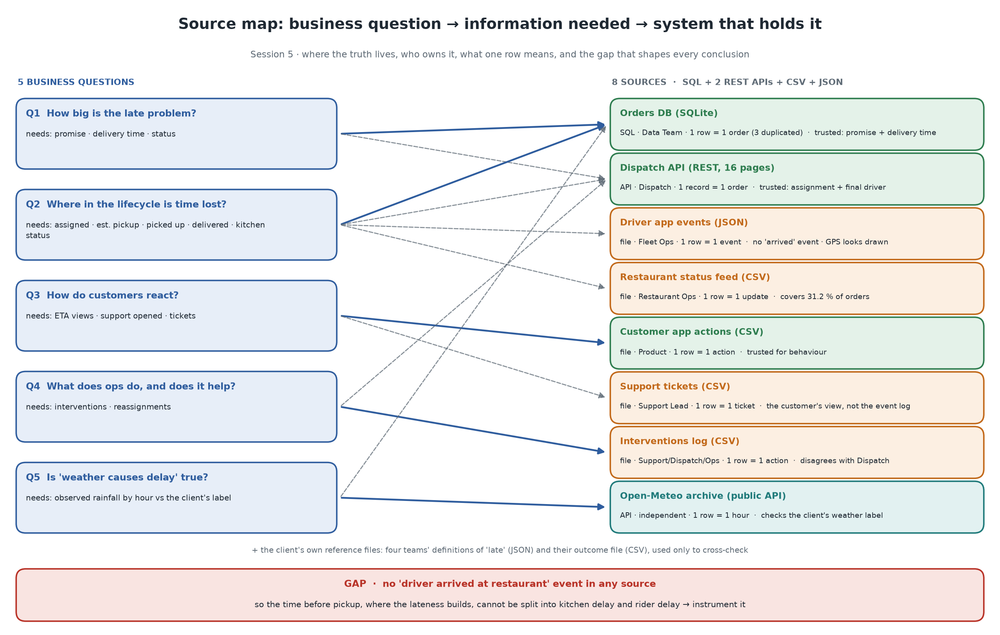

## 2 · Retrieval

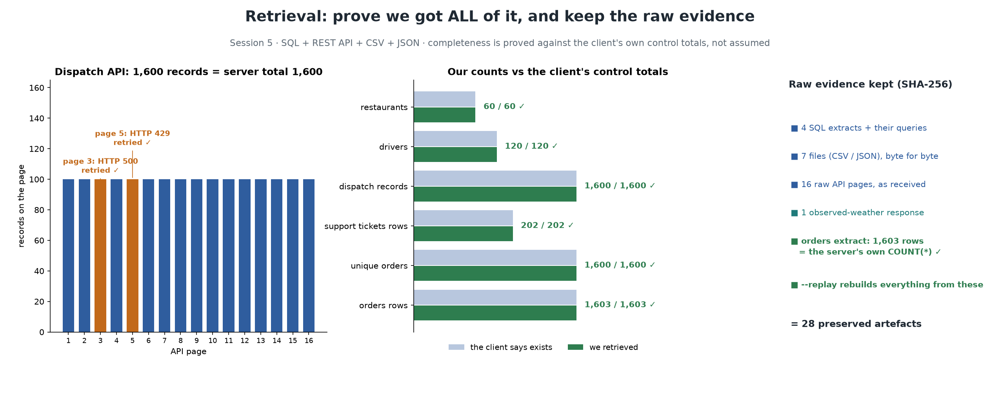

## 3 · Validation

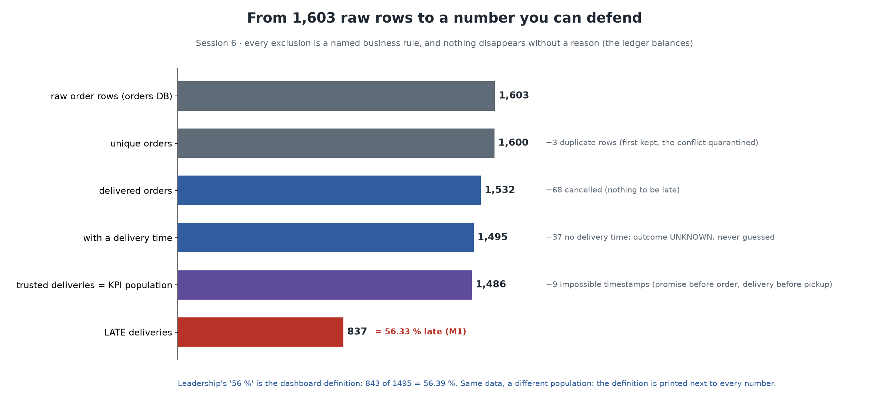


## 4 · Workflow + metrics

Start with one order, not an ER diagram:

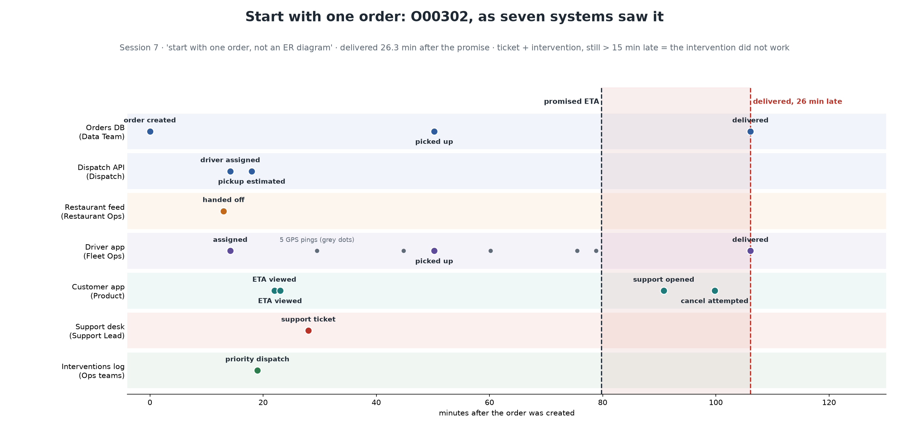

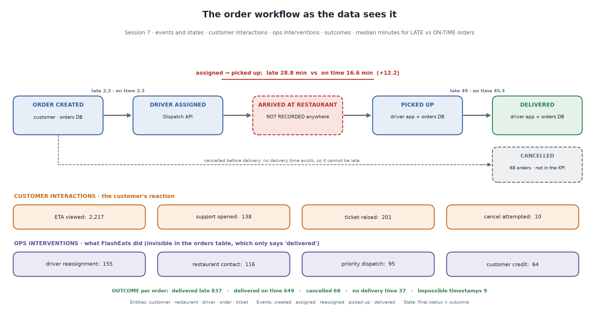

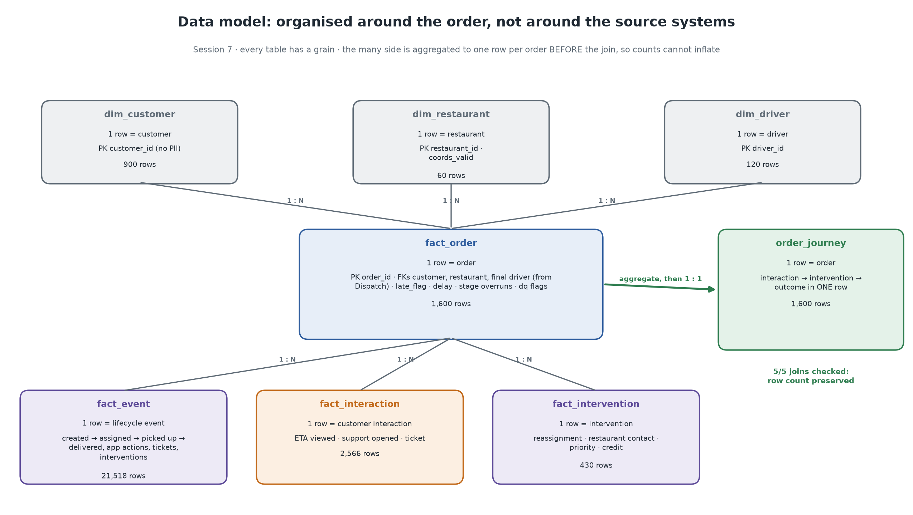

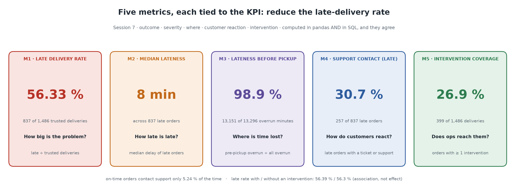

| # | Metric | Value | Question |
|---|---|---|---|
| M1 | Late delivery rate | **56.33 %** (837 / 1,486) | How big is the problem? |
| M2 | Median lateness of late orders | **8.0 min** | How late is late? |
| M3 | Lateness built up before pickup | **98.9 %** | Where is time lost? |
| M4 | Support contact on late orders | **30.7 %** vs 5.2 % on time | How do customers react? |
| M5 | Intervention coverage | **26.9 %** (late rate 56.4 % with, 56.3 % without) | Does ops reach them? |

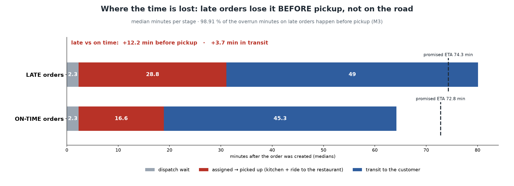

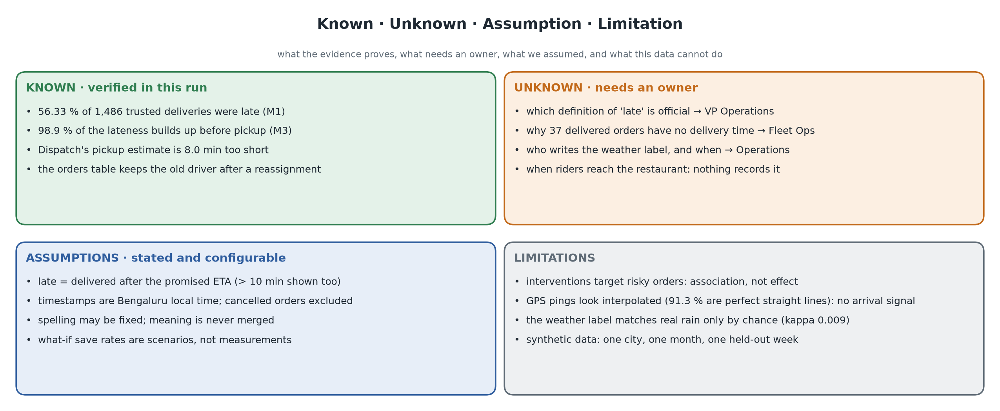

## 5 · Pipeline dependability


| Mode | Command | Result |
|---|---|---|
| Live | `python run_pipeline.py --start-api` | gate WARN → publish with caveats. A re-run is 0.00 pp vs the last publication, with 46/46 outputs identical |
| Replay | `python run_pipeline.py --replay run_example` | REPRODUCED: 28/28 raw files hash-verified, 46/46 outputs byte-identical. CI repeats it on Linux |
| Weekly | `python run_pipeline.py --start-api --weekly` | 4/4 weeks published, and they add up to the month (1,486 deliveries, 837 late) |

What happens on each failure, and the test that proves it: [docs/pipeline-dependability.md](docs/pipeline-dependability.md).

## The FDE judgement call

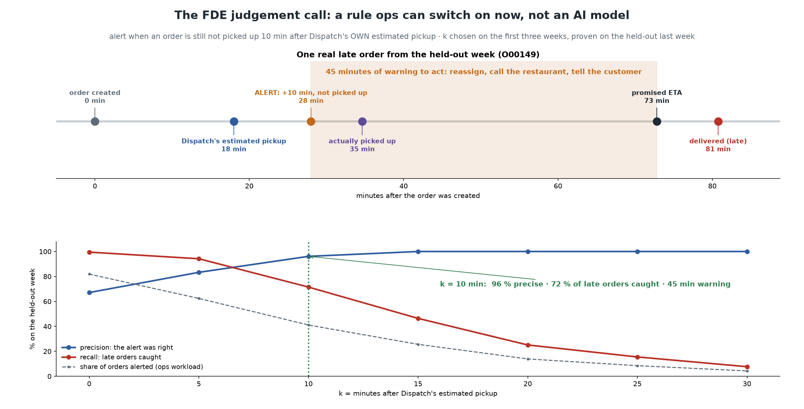

Build the AI predictor now? **Not yet, but act today.** The rule uses Dispatch's own estimate, was tested on a week it never saw, and would have reached 446 late orders that got no help. It is the baseline any model must beat.

## Beyond the class

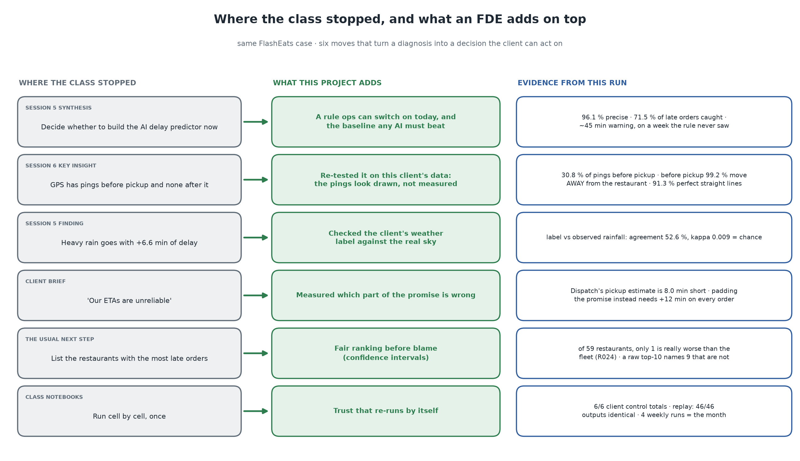

Full list and rationale: [docs/beyond-the-classroom.md](docs/beyond-the-classroom.md).

## Run it

```bash
cd assignment-2
python -m venv .venv && .venv\Scripts\activate          # Linux/macOS: source .venv/bin/activate
pip install -r requirements.txt

python run_pipeline.py --start-api                       # raw client systems -> output/ (evidence, dashboard, 15 pictures)
python run_pipeline.py --replay run_example --run-id run_replay_check   # rebuild from preserved raw, prove byte-identical
python run_pipeline.py --start-api --weekly              # 4 gated weekly runs + scorecard
python make_visuals.py                                   # redraw the pictures after --replay / --weekly
streamlit run app/dashboard.py                           # dashboard; its first tab is the visual story
python -m pytest                                         # 133 tests (also run in CI on every push)
python notebooks/build_notebooks.py                      # re-execute the 4 class notebooks + the walkthrough
```

- **Without Python:** open `output/dashboard.html`, a static page the pipeline generates. It is the only HTML in the project.
- **Change the policy:** set `kpi.late_threshold_min: 10` in [`config/pipeline.yaml`](config/pipeline.yaml) and rerun. Every metric, the gate, the memo and the pictures follow.
- **Exit codes:** `0` means completed, `1` means failed, and `2` means the gate failed and nothing was published.

## Where things are

| Path | What |
|---|---|
| [`Challenges/`](Challenges/) | the **four class notebooks**, answered and executed |
| [`notebooks/pipeline_walkthrough.ipynb`](notebooks/pipeline_walkthrough.ipynb) | the pipeline run stage by stage: retrieval, validation, model, joins, metrics |
| [`src/flasheats_pipeline/`](src/flasheats_pipeline/) | the pipeline code |
| [`config/`](config/) · [`sql/`](sql/) | owned thresholds and schema contract · extracts and SQL metric views |
| [`data/raw/run_example/`](data/raw/run_example/) | preserved raw inputs with SHA-256 |
| [`output/`](output/) | evidence, decision memo, gate, ledger, replay proof, weekly scorecard, pictures |
| [`docs/`](docs/) | [rubric map](docs/rubric-map.md) · [video script](docs/demo-script.md) · source map · data model · rules · metrics · assumptions · testing · dependability · traceability |
