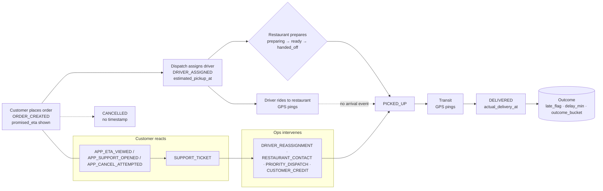
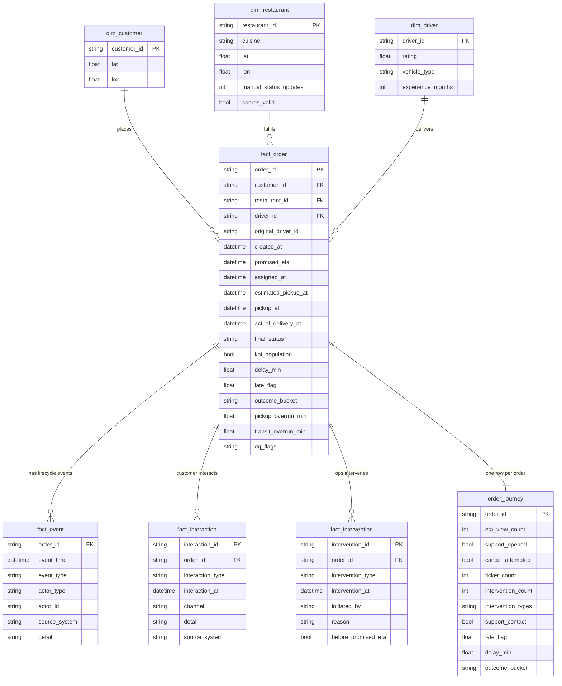
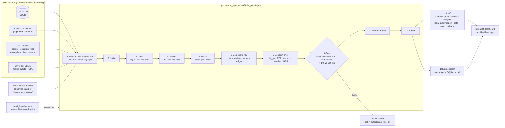

# Workflow and data model

## 1. The business workflow (what actually happens to an order)



States of an order: `created → assigned → (at restaurant?) → picked_up → delivered | cancelled`. The dotted edge is the missing instrumentation: nothing records when the driver **arrived** at the restaurant.

## 2. Entities, events, interactions, interventions, outcomes

| Concept | Instances in this domain |
|---|---|
| **Entities** (things that persist) | customer, restaurant, driver, order, support ticket, intervention |
| **Events** (things that happen, timestamped) | ORDER_CREATED, DRIVER_ASSIGNED, DRIVER_REASSIGNED, PICKUP_ESTIMATED, RESTAURANT_PREPARING/READY/HANDED_OFF, PICKED_UP, DELIVERED, DRIVER_APP_* (incl. GPS pings), APP_*, SUPPORT_TICKET, INTERVENTION_* |
| **States** | `final_status` (delivered / cancelled), `dispatch_status`, restaurant status, derived `outcome_bucket` |
| **User actions / interactions** | ETA viewed, support opened, cancel attempted, ticket raised |
| **Interventions** | driver reassignment (dispatch), restaurant contact (support), priority dispatch (operations), customer credit (support) |
| **Outcomes** | delivered on time / delivered late / cancelled / unknown (missing timestamp) / excluded (chronology rule) |

## 3. Relational model (produced by `src/flasheats_pipeline/model.py`)



| Table | Grain | Primary key | Foreign keys | Built from |
|---|---|---|---|---|
| `dim_customer` | customer | `customer_id` | — | SQL `customers` (no PII columns retrieved) |
| `dim_restaurant` | restaurant | `restaurant_id` | — | SQL `restaurants` + rule RG-02 |
| `dim_driver` | driver | `driver_id` | — | SQL `drivers` |
| `fact_order` | order | `order_id` | customer, restaurant, driver (final, from Dispatch) | SQL `orders` ⟕ Dispatch API ⟕ aggregated driver events; rules → `kpi_population`, `dq_flags` |
| `fact_event` | event | (order_id, event_time, event_type, source) | `order_id` | union of all timestamped facts in every source |
| `fact_interaction` | interaction | `interaction_id` | `order_id` | app actions ∪ support tickets |
| `fact_intervention` | intervention | `intervention_id` | `order_id` | interventions log + timing vs promise/delivery |
| `order_journey` | order | `order_id` | as `fact_order` | `fact_order` ⟕ aggregated interactions ⟕ aggregated interventions |

**Cardinality rule:** every one-to-many table is aggregated to order grain *before* it is joined; each merge is checked to preserve the left row count (`data/processed/join_checks.json`). `fact_order` and `order_journey` are asserted unique on `order_id`.

## 4. Stage model used for "where does delay accumulate"

```
created_at ──dispatch_wait──► assigned_at ──pickup_wait (prep + ride to restaurant)──► pickup_at ──transit──► actual_delivery_at
                                                 estimated_pickup_at (plan)                          promised_eta (plan)
```

`delay = (pickup_at − estimated_pickup_at) + [(actual − pickup) − (promised − estimated_pickup)]`
`      =  pre-pickup overrun               +  transit overrun` — an exact identity (checked on every run).

## 5. Why not mirror the source tables?

The sources are organised by system and disagree on grain (1603 vs 1600 orders), spelling (`Delivered`/`delivered`, `handoff`/`handed_off`) and even on who the driver is. Re-organising them around the order lifecycle gives one auditable table per business question and makes the denominator of every metric explicit (`kpi_population`), which is what the KPI needs.

## 6. Pipeline architecture

The editable sources are in `docs/diagrams/`: `architecture.mmd`, `source-map.mmd` and `data-model.mmd`. GitHub renders the architecture below:


