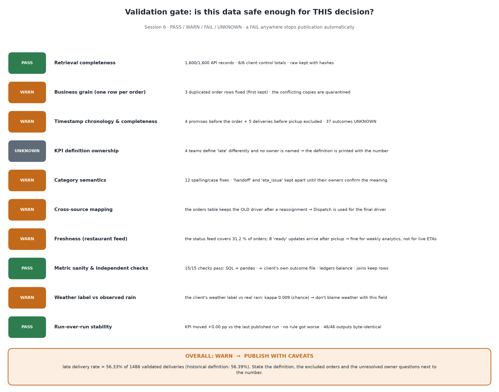

# Business-oriented data-quality rules (validation contract)

Implemented in `src/flasheats_pipeline/rules.py`; results for the last run in `output/data_quality_report.md` (Section 5) and `output/data_quality_rules.csv`.

Every rule states: **business assumption → business reason → detection → action → impact → limitation / owner.** Actions:

- **correct** – representation fixed by the cleaning stage and logged (never a semantic merge);
- **flag** – record kept, `dq_flags` carries the rule id, breakdowns treat it accordingly;
- **reject** – record excluded from the *KPI population* (`kpi_population=False`, reason stored) – never deleted;
- **retain** – informational; documented for the owner.

Status per rule: PASS · WARN (violations exist, decision-safe with caveat) · FAIL (metric untrustworthy) · UNKNOWN (cannot be tested).

**The FAIL tolerances are owned by stakeholders, not by the code.** They are set in the `data_quality` section of [`config/pipeline.yaml`](../config/pipeline.yaml), each with an owner comment, and are recorded in every run manifest:

- `max_unexpected_status_pct` (ST-01, 10 %);
- `max_unparseable_kpi_timestamp_pct` (TS-00, 10 %);
- `max_missing_delivery_time_pct` (TS-04, 15 %).

A partition that breaks a tolerance is refused, not published (`tests/test_periods.py::test_default_policy_refuses_noisy_partitions`).



## Rule catalogue (with the findings on the classroom pack)

| Rule | Assumption | Business reason | Detection | Action | Found | Impact on KPI | Limitation / owner |
|---|---|---|---|---|---|---|---|
| **GR-01** | one row = one order | every denominator counts orders | `order_id` duplicated | correct (exact dup dropped; conflicting dup keeps first, conflict quarantined) | 3 duplicate rows that *disagree on traffic_bucket* | none after fix; traffic breakdown for 3 orders uses the first row | Data Team: why two writers? |
| **ID-01** | `order_id` present and well-formed | nothing joins without it | null (quarantine) / layout ≠ `O#####` | flag | 0 | — | — |
| **ID-02/03/04** | customer / restaurant / driver ids resolve | attribution needs a real entity | not in dimension or null | flag | 3 null restaurant, 3 null driver | none on M1; those orders excluded from restaurant/driver rankings | Restaurant Ops / Fleet Ops |
| **ID-05** | ticket → order | complaint reconciliation | null / unknown order | flag | 3 tickets without order id | M4 counts only mapped tickets | Support Lead |
| **ID-06** | restaurant status → order, same restaurant | foreign-platform rows would corrupt restaurant metrics | unknown order / restaurant mismatch | flag | 0 | — | — |
| **ID-07** | app action → order and its customer | interaction counts must belong to the right order | unknown order / customer mismatch | flag | 0 | — | — |
| **ID-08** | intervention → order | link intervention to outcome | unknown order | flag | 0 | — | — |
| **ID-09** | orders ⇄ Dispatch cover each other | reassignment context | missing either way | flag (FAIL if < 50 % coverage) | 100 % | — | Dispatch |
| **ID-10** | driver events → order | telemetry usable | unknown order | flag | 0 | — | — |
| **ST-01…09** | each categorical column uses its agreed vocabulary | new/odd values silently leave or enter populations | value ∉ vocabulary after representation fix | flag (ST-01 FAIL if > 10 % unexpected) | `Delivered`×5, `HIGH`×3, `READY/Ready/ready `×4, `Late Delivery`, `late_delivery ` corrected; `handoff`×1 and `ETA issue`×1 **kept**, semantic candidates reported | none | Restaurant Ops (`handoff`), Support Lead (`ETA issue`) |
| **TS-00** | KPI timestamps parse | unparseable values shrink the population silently | present but unparseable (incl. mixed tz) | reject (FAIL > 10 %) | 0 (pack); tested with `not-a-date` and `+05:30` | — | Data Team |
| **TS-01** | promise after creation | lateness vs an impossible promise is meaningless | `promised_eta < created_at` | reject | 4 (exactly −10 min) | −4 orders, all "late" by 85–87 min: would inflate M2 | ETA service |
| **TS-02** | delivery after pickup | one clock is wrong | `actual < pickup` | reject | 5 (exactly −5 min) | −5 orders | Fleet Ops |
| **TS-03** | pickup after creation | negative stage durations | `pickup < created` | reject | 0 | — | — |
| **TS-04** | delivered ⇒ delivery time | outcome unknown otherwise | delivered & null actual | reject (FAIL > 15 %) | 37 (all have a driver `delivered` event) | KPI bounded 55.0 %–57.4 %; back-fill sensitivity = 56.5 % | Fleet Ops decides on back-fill |
| **TS-05** | cancelled ⇒ no delivery time | status bug | cancelled & actual present | flag | 0 | — | — |
| **TS-06** | dispatch chronology | assignment timing feeds M3 | `assigned < created` or `reassigned < assigned` | flag | 0 | — | — |
| **TS-07** | driver-event chronology | telemetry must be internally consistent before back-filling | `picked_up < assigned` or `delivered < picked_up` | flag | 14 | those orders excluded from any back-fill decision | Fleet Ops |
| **RG-01** | distance ∈ (0, 50] km | 999-km "estimates" distort distance analysis | out of range / null | flag | 0 (pack); tested with 999 | excluded from distance band | Operations |
| **RG-02** | restaurant coordinates inside service area | geo inference impossible with lat 95 | outside bounding box | flag | R007 (lat 95.12), R019 (lon 190.33) | `coords_valid=False`; no geo use | Restaurant Ops |
| **RG-03** | GPS pings inside service area | outlier pings corrupt route inference | outside bounding box | flag | 189 of 5 371 | no geo inference attempted | Fleet Ops |
| **RG-04** | driver rating 0–5, experience ≥ 0 | dimension sanity | out of range | flag | 0 | — | — |
| **CX-01** | `orders.driver_id` = Dispatch final driver | wrong driver blamed after reassignment | mismatch | retain (Dispatch used as final driver) | 95 mismatches = all reassignments; orders table holds the ORIGINAL driver | driver breakdown uses Dispatch | Dispatch / Data Team |
| **CX-02** | `orders.pickup_at` = driver `picked_up` | two systems, one fact | \|Δ\| > 60 s | retain | 5 (the TS-02 orders) | — | Fleet Ops |
| **CX-03** | interventions log ⇄ Dispatch reassignments | one log is incomplete otherwise | set comparison | retain | 155 vs 95, overlap 8 | M5 "reassignment" figures cannot be trusted as complete | Support Lead / Dispatch |
| **FR-01** | restaurant status fresh enough for its use | stale `ready` is useless live and unfair for accountability | `ready/handed_off` > 15 min after pickup; update before creation | flag | 8 stale, 5 before creation, 31 % coverage, minute precision | weekly analytics only | Restaurant Ops |
| **WX-01** | the order's weather label reflects real weather | weather is blamed for delay; a label that does not match the sky cannot support that story or train a model | join each order's creation hour to Open-Meteo hourly precipitation (Bengaluru); labelled rain vs observed rain > 0.1 mm; Cohen's kappa | retain (gate check) | agreement 53 %, **kappa 0.01** (chance level) | none on M1; weather breakdowns are labelled *client label, unverified* | Operations / Data Team: who writes `weather_bucket` and when? |
| **KPI-01** | one agreed definition and owner of "late" | four definitions ⇒ four numbers | `client_metric_definitions.json` | retain → gate UNKNOWN | no owner documented | every output states the definition next to the number | VP Operations |

## How the rules become the KPI population

```
all unique orders (1600)
 − cancelled (68)                     → outcome_bucket = cancelled
 − delivered without timestamp (37)   → unknown_missing_timestamp   (TS-04)
 − chronology violations (4 + 5)      → excluded_dq_rule            (TS-01, TS-02)
 = validated population (1486)  →  late 837 / on time 649  →  56.33 %
```

Historical-definition population (1495) and the back-fill sensitivity (1523) are reported next to it in `output/breakdowns/definition_comparison.csv`.

## Hidden-data behaviour (tested in `tests/`)

| Hidden defect | Behaviour |
|---|---|
| column headers in other case / extra columns / BOM | normalised, extras recorded |
| ids with whitespace / lowercase | trimmed + upper-cased, joins still work |
| new category values (`gridlock`, `refunded`, `suspended`) | retained, flagged, never mapped; not counted as delivered |
| malformed timestamps, mixed timezone suffixes | coerced to NaT / converted; counted; KPI excludes them; > 10 % ⇒ FAIL |
| 999 km distance, lat 95 | flagged, excluded from distance/geo views |
| duplicate rows / duplicate business events | exact dups dropped and counted; conflicting dups quarantined; counts aggregated per order never inflate |
| unknown order ids in tickets / status / interventions / dispatch | retained, flagged, coverage % reported |
| empty orders table, zero API records, missing required file, missing database | clear failure or gate FAIL, nothing half-published |
| API 429/500/timeout/malformed JSON/missing keys/overlapping pages/wrong total/never-ending pagination | retried with back-off, validated, incompleteness blocks publication |
