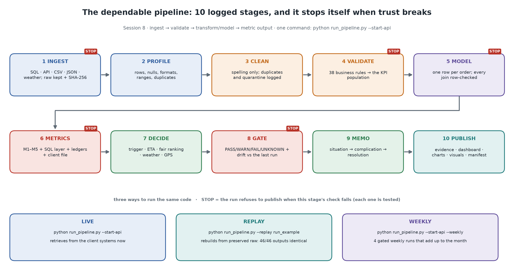
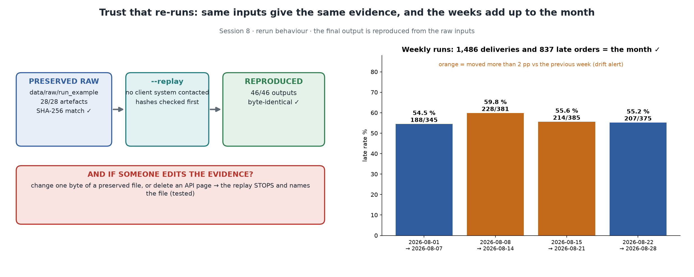

# Pipeline dependability (Session 8)

The brief asks for `ingest → validate → transform/model → metric output`, with logging, checks, rerun behaviour and failure handling. This page shows how each is met, picture first.



## The ten stages and the check that can stop each one

| # | Stage | Module | Check that gates the next stage | Written artefacts |
|---|---|---|---|---|
| 1 | Ingest + raw preservation | `ingest/*`, `contracts.py`, `scope.py` | files and tables exist; the **schema contract** holds (a missing required column stops the run); API pagination is complete (records = `total_records`, unique ids); the **orders extract equals the server's `COUNT(*)`**; counts match the **client's control totals**. A replay first **verifies every SHA-256** | `data/raw/<run_id>/` (SQL extracts + queries, byte copies, every raw API page, weather response, `ingestion_manifest.json`, `control_totals.csv`) |
| 2 | Profile | `profiling.py` | read-only | `output/profile/` |
| 3 | Clean | `cleaning.py` | every change counted; unusable rows quarantined; period scoping logged as `out_of_period` | `output/data_quality_report.*`, `output/quarantine/` |
| 4 | Validate | `rules.py` | 38 business rules → PASS / WARN / FAIL / UNKNOWN. The tolerances are owned in `config/pipeline.yaml` | `output/data_quality_rules.csv` |
| 5 | Model | `model.py` | duplicate keys are dropped and counted before each join; `fact_order` and `order_journey` must stay one row per order, or the run raises | `data/processed/*.csv`, `flasheats_model.sqlite`, `join_checks.json` |
| 6 | Metrics | `metrics.py`, `sql_metrics.py`, `monitoring.py` | denominators > 0; late + on time = population; stage identity; client outcome file reconciles; **SQL views = pandas**; independent SQL recomputation; both ledgers balance | `output/metrics.*`, `metric_checks.csv`, `sql_metric_layer_check.csv`, `sql_metric_views/`, `reconciliation_ledger.csv` |
| 7 | Decision layer | `insights.py` | every what-if is labelled as an assumption | `output/insights/` |
| 8 | Gate + drift | `gate.py`, `monitoring.py` | 10 checks → overall status. Any FAIL refuses publication. Outputs are fingerprinted and compared with the last published run | `output/validation_gate.*`, `run_comparison.*` |
| 9 | Decision memo | `reports.py` | written from the gate and the metrics, so the words cannot disagree with the numbers | `output/decision_memo.md` |
| 10 | Publish | `reports.py`, `visuals.py` | publish only if the gate is not FAIL | evidence table, K/U/A/L, charts, **15 visuals**, `dashboard.html`, `run_manifest.json`, `pipeline.log` |

## Three ways to run the same code

| Mode | Command | What it proves | Result on the client pack |
|---|---|---|---|
| **Live** | `python run_pipeline.py --start-api` | retrieval from the client systems now, with every check | gate WARN → publish with caveats. A re-run is 0.00 pp vs the last publication, with 46/46 outputs byte-identical |
| **Replay** | `python run_pipeline.py --replay run_example --run-id run_replay_check` | the published output can be rebuilt from preserved raw inputs alone | **REPRODUCED**: 28/28 artefacts hash-verified, 46/46 outputs byte-identical, no client system contacted ([`output/replay_proof.md`](../output/replay_proof.md)) |
| **Weekly** | `python run_pipeline.py --start-api --weekly` | the same pipeline works as a scheduled job, one gated run per week | 4/4 weeks published. The partition check passes (1,600 orders, each in exactly one week), and the weeks add up to the month: 1,486 deliveries, 837 late ([`output/scorecard.md`](../output/scorecard.md)) |



## Failure handling: what happens if…

| Situation | Behaviour | Test |
|---|---|---|
| database or required file missing, empty or unreadable | run **FAILED** with a message naming the object. The manifest is still written and nothing is published | `test_missing_required_file_names_the_file`, `test_missing_database_fails_clearly`, `test_zero_byte_file_is_a_clear_error` |
| a required column disappears (schema drift) | the run stops and names the column. An unexpected extra column only warns | `test_missing_required_column_names_the_column`, `test_schema_contract_rules`, `test_uncontracted_api_field_only_warns` |
| API timeout, connection error, 429 or 5xx | retried with exponential back-off (honours `Retry-After`), then FAILED with the page and the cause | `test_retries_500_and_429_then_succeeds`, `test_timeout_is_retried_then_fails_clearly` |
| API 4xx configuration error | not retried; FAILED immediately | `test_404_is_not_retried` |
| API incomplete (count mismatch, overlapping pages, empty) | the run continues so the evidence is visible, but the gate **FAILS** and nothing is published | `test_incomplete_api_blocks_publication`, `test_wrong_total_marks_incomplete`, `test_overlapping_pages_are_detected` |
| API down, but an earlier snapshot exists | `--fallback-snapshot` reuses the newest preserved pages; retrieval degrades to **WARN**, never silently | `test_api_down_with_snapshot_fallback_degrades_to_warn` |
| counts differ from the client's control totals | the gate **FAILS**: "a count mismatch against the owner's control totals refuses publication" | `test_control_total_mismatch_refuses_publication` |
| a defect is above its policy tolerance (e.g. > 15 % delivered without a delivery time) | the gate **FAILS** | `test_default_policy_refuses_noisy_partitions`, `test_all_timestamps_unparseable_fails_the_gate_instead_of_publishing_zero` |
| a preserved raw file is edited, or an API page is deleted | the replay **stops before computing anything** and names the file | `test_tampered_preserved_file_stops_the_replay`, `test_deleted_api_page_stops_the_replay` |
| one week's data is broken | that week is refused, and the other weeks still publish | `test_a_failing_period_does_not_block_the_others` |
| the observed-weather API is unreachable | falls back to the committed reference copy, or the weather rule becomes UNKNOWN; never fatal | `test_unusable_responses_fall_back_to_cache_then_unavailable` |
| any unexpected exception | caught by the orchestrator; the traceback goes into the manifest; status FAILED; exit code 1 | `test_api_down_fails_clearly_and_writes_manifest` |
| a figure cannot be drawn | the figure is skipped with a warning; the evidence run never breaks | `test_messy_pack_end_to_end_outputs_and_raw_preservation` |

**Exit codes:**

- A single run returns `0` completed, `1` failed, or `2` gate failed. On `2`, outputs are kept in `output/runs/<run_id>/` and not published.
- `--weekly` returns `0` when every week published, `1` when any week failed, and `2` when a week was refused.

## Rerun behaviour

- Every run has a `run_id`. Raw snapshots live in `data/raw/<run_id>/`, and `.gitignore` keeps only `run_example` in git.
- `output/` is the latest *published* view. The per-run copy lives in `output/runs/<run_id>/`.
- **Fingerprints:** each run records a SHA-256 of 46 deterministic outputs:
  - metrics, checks, rules and ledger;
  - breakdowns, insights and SQL views;
  - quarantine files and processed tables.

  The next run compares against them. The same inputs give byte-identical outputs (`test_rerun_on_same_inputs_is_byte_identical`).
- **Drift:** the KPI and every rule's status and violations are compared with the last published run. That includes a re-run of the same run id, which is compared with its previous publication. The gate WARNs if the KPI moves more than `monitoring.kpi_drift_alert_pp` (2 pp) or a rule gets worse.
- **Policy file:** every business threshold lives in [`config/pipeline.yaml`](../config/pipeline.yaml) with its owner. An unknown key fails the run instead of silently using a default.

## Logging

There is one log per run, at `output/runs/<run_id>/pipeline.log`, which is copied to `output/pipeline.log` on publication. It records:

- stage banners and row counts in and out of every stage;
- every cleaning action with its count;
- every rule with its status and violations;
- every merge with its cardinality;
- every metric with its numerator and denominator;
- every gate check.

`grep WARNING pipeline.log` gives the list of things that need an owner.

## Reproducing the submitted outputs

```
python -m venv .venv && .venv\Scripts\activate      # or: source .venv/bin/activate
pip install -r requirements.txt
python run_pipeline.py --start-api --run-id run_example
python run_pipeline.py --replay run_example --run-id run_replay_check
python run_pipeline.py --start-api --weekly --run-id run_weekly
python make_visuals.py                              # redraw the pictures with the replay + weekly panels
python -m pytest                                    # 133 tests; the same suite runs in CI (.github/workflows/tests.yml)
```
