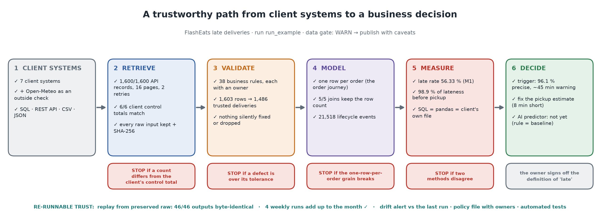

# Rubric map: where each grading area and submission item is evidenced

The brief grades five areas at 20 % each, and asks for *"a trustworthy path from client systems to a business decision"*. Each row below points to:

- the **picture** (in `output/visuals/`, redrawn by every run);
- the **file** or **code**;
- the **test** that proves it;
- the **moment in the demo video** ([`docs/demo-script.md`](demo-script.md)).

## The five grading areas (20 % each)

| Area | What the brief asks | Picture | Evidence (files and code) | Proven by | Video |
|---|---|---|---|---|---|
| **Source reasoning** | business questions → required information → source systems; ownership, grain, gaps | `02_source_map.png` | [`docs/source-map.md`](source-map.md): 5 questions, 8 sources (7 client + 1 outside) with owner, grain, trust and access; 9 gaps, led by the missing *arrived at restaurant* event | the gap is carried into K/U/A/L and the memo | 0:25 |
| **Retrieval** | at least two retrieval modes; show retrieval is complete; preserve raw inputs | `03_retrieval_proof.png` | SQL (`ingest/sql_source.py`, `sql/`), REST API with pagination and retries (`ingest/api_source.py`), CSV/JSON (`ingest/file_source.py`), public weather API (`ingest/weather_source.py`); 1,600/1,600 records; **6/6 client control totals**; extract = server `COUNT(*)`; 28 raw artefacts with SHA-256 in `data/raw/run_example/` | `test_api_source.py` (15), `test_completeness.py` (7), `test_file_source.py`, `test_sql_source.py`, `test_weather_source.py` | 1:05 |
| **Validation** | profile; meaningful quality issues; business rules; assumptions and limitations recorded, not silently fixed | `04_kpi_funnel.png`, `05_validation_gate.png`, `11_known_unknown.png` | profile before cleaning (`output/profile/`); 38 rules with reason, action and owner ([`docs/data-quality-rules.md`](data-quality-rules.md)); quarantine; record ledger; PASS/WARN/FAIL/UNKNOWN gate; K/U/A/L | `test_cleaning_rules.py`, `test_hidden_messy_data.py` (9), `test_timestamps.py`, `test_monitoring.py` | 1:50 |
| **Workflow + metrics** | entities, events/states, interactions, interventions, outcomes; relational/event model; 3–5 metrics linked to the KPI | `06_one_order_journey.png`, `07_order_lifecycle.png`, `08_data_model.png`, `09_metrics_board.png`, `10_where_delay_builds.png` | [`docs/data-model.md`](data-model.md); `model.py` (3 dimensions, 4 facts and the order-journey table; aggregate before join); M1–M5 in `metrics.py` **and** `sql/40_metric_views.sql`; [`docs/metrics.md`](metrics.md); [`output/evidence_table.md`](../output/evidence_table.md) | `test_model_metrics.py` (11: hand-checked metrics, `test_checked_merge_never_multiplies_rows`), `test_sql_metric_layer_agrees_with_pandas` | 2:40 |
| **Pipeline dependability** | ingest → validate → transform/model → metric output; logging and checks; rerun behaviour; failure handling | `12_pipeline_flow.png`, `13_reproducibility.png` | `run_pipeline.py` (10 logged stages, exit codes); `--replay` (REPRODUCED 46/46); `--weekly` (4 gated weeks that add up to the month); fingerprints and drift; policy file; CI ([`docs/pipeline-dependability.md`](pipeline-dependability.md)) | `test_pipeline_e2e.py` (10), `test_replay.py` (7), `test_periods.py` (5), `test_monitoring.py` (5); 133 tests in total, run in CI | 3:30 |

## The submission package

| Item required by the brief | Where it is |
|---|---|
| GitHub project URL | https://github.com/Bhuvanesh66/FDE-Assignment-2 |
| README: problem, users/stakeholders, project KPI, source overview, setup/run, decision supported | [`README.md`](../README.md): the table at the top covers the first five; the "Run it" section covers setup and run |
| Source map + workflow/data model diagram, stored in the repo | `output/visuals/02_source_map.png`, `06_one_order_journey.png`, `07_order_lifecycle.png`, `08_data_model.png` · [`docs/source-map.md`](source-map.md) · [`docs/data-model.md`](data-model.md) · editable sources in [`docs/diagrams/`](diagrams/) |
| Code/notebooks: retrieval, validation, modelling, joins/aggregations, metrics | `src/flasheats_pipeline/` · [`notebooks/pipeline_walkthrough.ipynb`](../notebooks/pipeline_walkthrough.ipynb) (stage by stage, with outputs) · the 4 class notebooks in [`Challenges/`](../Challenges/) |
| A runnable pipeline that reproduces the final output from raw inputs | `python run_pipeline.py --start-api` (live) · `python run_pipeline.py --replay run_example` (from the preserved raw inputs alone: [`output/replay_proof.md`](../output/replay_proof.md)) |
| Final evidence table/dashboard with 3–5 metrics | [`output/evidence_table.md`](../output/evidence_table.md) · `output/visuals/09_metrics_board.png` · `output/dashboard.html` · `streamlit run app/dashboard.py` |
| A brief Known / Unknown / Assumption / Limitation section | `output/visuals/11_known_unknown.png` · [`output/known_unknown_assumption_limitation.md`](../output/known_unknown_assumption_limitation.md) · [`docs/assumptions-limitations.md`](assumptions-limitations.md) |
| A 3–5 minute demo explaining one important FDE judgement call | [`docs/demo-script.md`](demo-script.md) (5:00; the judgement call is at 4:15) · `output/visuals/14_judgement_call.png` |

## "What matters most": explicit, defensible, connected to the KPI

| The brief says | How the project shows it |
|---|---|
| move from messy client data… | 1,603 raw rows with duplicates, bad timestamps, spelling variants, stale drivers, a fake-looking GPS feed and a chance-level weather label, each handled by a named rule ([`output/data_quality_report.md`](../output/data_quality_report.md)) |
| …to a trustworthy operational model… | an order-grain model whose joins cannot inflate; M1 computed by pandas, by SQL views and by an independent SQL query on the raw database, and reconciled with the client's own outcome file |
| …and a repeatable output | one command; replay proves byte-identical output; weekly runs add up to the month; the gate refuses to publish on any FAIL |
| choices explicit and defensible | every threshold in [`config/pipeline.yaml`](../config/pipeline.yaml) has an owner; every exclusion has a rule id; the judgement call is backtested on a held-out week |
| connected to the business KPI | M1–M5 each answer one question about reducing the late-delivery rate; the decision memo turns them into owned actions with a way to measure each ([`output/decision_memo.md`](../output/decision_memo.md)) |
