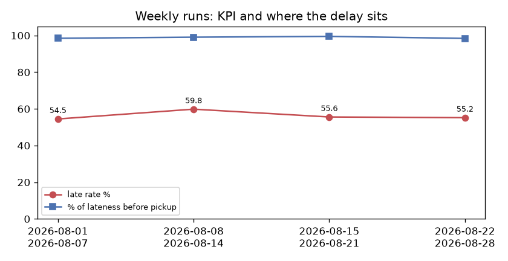

# Period scorecard — late-delivery KPI, one validated run per period

**Overall: COMPLETE** · 4 of 4 periods published · partition check **PASS** (1600 orders across periods vs 1600 unique orders in the source; the periods add up to the full-period run: 1486 validated deliveries and 837 late orders vs 1486 and 837 → yes)

| period | status | gate | orders | validated_population | late_orders | late_rate_pct | wow_change_pp | drift_flag | median_lateness_min | share_before_pickup_pct | support_contact_late_pct | pickup_estimate_bias_min |
|---|---|---|---|---|---|---|---|---|---|---|---|---|
| 2026-08-01_2026-08-07 | PUBLISHED | WARN | 372 | 345 | 188 | 54.49 |  | False | 8.00 | 98.49 | 32.45 | 7.70 |
| 2026-08-08_2026-08-14 | PUBLISHED | WARN | 409 | 381 | 228 | 59.84 | 5.35 | True | 8.00 | 99.09 | 30.26 | 8.30 |
| 2026-08-15_2026-08-21 | PUBLISHED | WARN | 412 | 385 | 214 | 55.58 | -4.26 | True | 8.30 | 99.53 | 29.91 | 8.20 |
| 2026-08-22_2026-08-28 | PUBLISHED | WARN | 407 | 375 | 207 | 55.20 | -0.38 | False | 7.60 | 98.43 | 30.43 | 8.00 |

Drift flag: the late rate moved more than 2 pp versus the previous period (policy: `monitoring.kpi_drift_alert_pp`).
Each period's full evidence (gate, data-quality report, metrics, decision memo) is in `output/periods/<period>/`.

